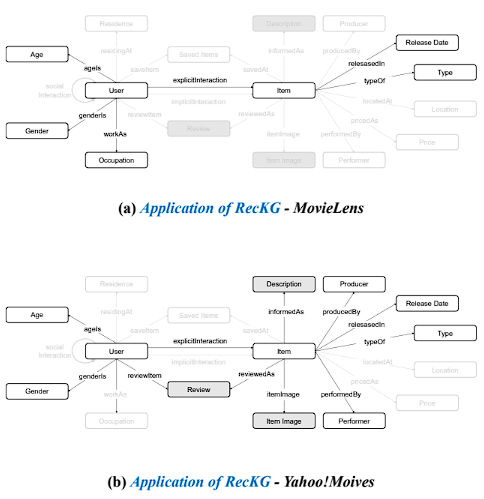
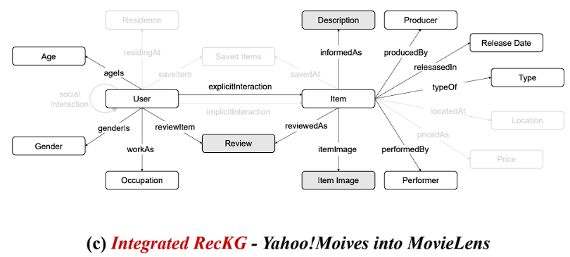
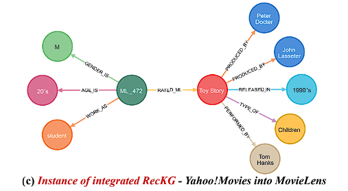

# RecKG: Knowledge Graph for Recommender Systems
### ***ACM/SIGAPP SAC 2024 accepted paper (Oral)*** (Accaptance rate < 25%)

**This repository is an official implementation of the paper ["RecKG: Knowledge Graph for Recommender Systems"](https://dl.acm.org/doi/10.1145/3605098.3636009).**  
You can also download our research paper [here](https://drive.google.com/file/d/13_AKtQeVyaz2GwE0Ko7faAijInJJDwFb/view?usp=sharing).  
The implemented version as a interactive dataset preprocessing tool of RecKG: [RecKG-web](https://github.com/ttytu/RecKG-web).  

### **Abstract**

Within the field of recommender systems, there has been a shortage of research considering the integration of KGs, and notably, there is a lack of studies contributing to seamless integration. To facilitate the smooth integration of heterogeneous KGs, it is essential to ensure a consistent representation of entities that appear in different datasets while also accommodating diverse types of attributes.  

In this study, we propose RecKG, a standardized KG for recommender systems, taking into consideration the crucial factors for data integration. We thoroughly examined various datasets from recommender systems to carefully select the attributes of RecKG, ensuring standardized formatting through consistent naming conventions, regardless of the knowledge base.


# Collecting TMDB information
### **No need to run the code as the data is already in the ./data directory.**

We obtained actor, director, and writer information by connecting the movie_id in TMDB, which is linked to each movie_id in Movielens, and merged it into Movielens data.

- **Changing the API key is required in the following code.**
- Fortunately, the collected data is in the ./data directory, so running the following code is not necessary.

```python 
python movielens-tmdb-merge.py
```

# Constructing Simple RecKG
### **No need to run the code as the data is already in the ./data directory.**



In this study, Movielens data and Yahoo!Movies data were each converted into the RecKG format.  
The constucted data is in the ./data directory, so running the following code is not necessary.  

First, convert the Movielens data into RecKG format.  
```python
python movielens-kg.py
```


Second, convert the Yahoo!Movies data into RecKG format.  
```python
python yahoo-movie-kg.py
```


# Integrating RecKG

Standardizing two real-world datasets using RecKG, we apply it to a graph database management system. In doing so, we verify the interoperability of RecKG and conduct analysis through integrated RecKG.

The integration of two real-world datasets (Movielens data and Yahoo!Movies data).  
```python
python kg-merge.py
```

# Visualizing RecKG by Neo4j

We demonstrate the application of RecKG to various real-world recommender system datasets using the graph database management system Neo4j. This showcases not only the necessity of RecKG for KG-based recommender systems but also its suitability for implementation within a graph database. Utilize the following cypher queries using the Neo4j desktop app's Neo4j Browser.   

**Be careful when visualizing all the nodes, it will require too many virtual storage.**  
```python
ml_simple.cypher
ym_simple.cypher
integrated_RecKG.cypher
```


# Citation
If you would like to cite this paper, please make a copy of the following text. Thank you🤣
```bibtex
@inproceedings{kwon2024reckg,
  title={RecKG: Knowledge Graph for Recommender Systems},
  author={Kwon, Junhyuk and Ahn, Seokho and Seo, Young-Duk},
  booktitle={Proceedings of the 39th ACM/SIGAPP Symposium on Applied Computing},
  pages={600--607},
  year={2024}
}
```
